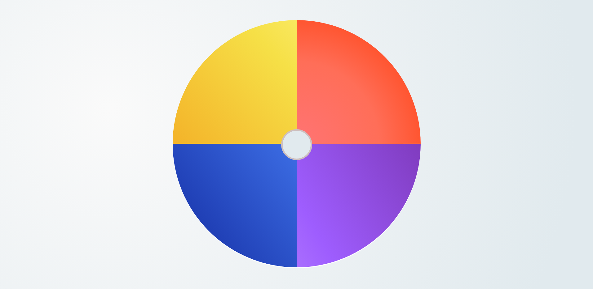

# Meu PrimeiroProjeto

Projeto: Emoções 🌟
Este é o primeiro projeto que desenvolvi, utilizando apenas HTML e CSS puro! 🎉

O tema é emoções, e o objetivo foi explorar a criatividade e praticar conceitos básicos de estrutura e estilização para representar sentimentos por meio do design.

O que você encontrará:
Estruturas simples feitas em HTML.
Estilizações e animações com CSS.
Um layout que busca transmitir diferentes emoções por cores, formas e interações.
Por que criar este projeto?
Este projeto marca o início da minha jornada no desenvolvimento web e é uma lembrança do meu aprendizado inicial. Espero que sirva de inspiração para outros que também estão começando! 🚀
